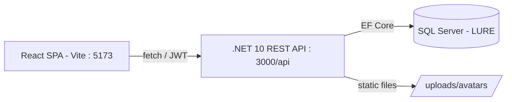

<div align="center">

# 🐟 Lure

**A full-stack, Twitter-style social network — React + .NET + SQL Server.**
*Una red social tipo Twitter, full-stack — React + .NET + SQL Server.*


[English](#-english) · [Español](#-español)

</div>

---

## 📸 Screenshots

> Añade aquí tus capturas (la app corre en `http://localhost:5173`). Sugerencia: crea `docs/screenshots/` y referencia las imágenes.
>
> `` · `` · ``

---

## 🇬🇧 English

**Lure** is a social network inspired by Twitter/X, built as a final degree project (TFG) and now polished as a portfolio piece. It is a complete full-stack application: a **React SPA** talking to a **.NET 10 REST API** backed by **SQL Server**.

### ✨ Features

- 🔐 **Authentication** — register & login with **JWT** and **bcrypt**-hashed passwords; protected routes.
- 📝 **Tweets** — publish posts (with image / video / PDF media), shown in real time in your feed and profile.
- ❤️ **Interactions** — like, retweet, save (bookmarks) and comment — all persisted in the database with per-user state.
- 👥 **Social graph** — follow / unfollow users; real follower & following counts.
- 🙋 **Profiles** — your own editable profile (name, bio, location, birthday, achievements, interests, skills, **profile photo upload**) and **public profiles** of other users.
- 🔎 **Explore** — search tweets and accounts; trending topics.
- 💬 **Direct messages** — real conversations stored in the DB.
- 🏘️ **Communities** — list and join / leave.
- 🔔 **Notifications** — derived from real activity (likes, replies, new followers).
- 💎 **Premium** — Apple-style pricing page.
- 🎨 **UI/UX** — X.com-style dark interface, responsive (mobile / tablet / desktop), lazy-loaded routes.

### 🧱 Tech stack

| Layer | Tech |
|---|---|
| **Frontend** | React 18, Vite 8, React Router 6, Ant Design, lucide-react |
| **Backend** | .NET 10, ASP.NET Core Web API, Entity Framework Core 10 |
| **Auth** | JWT (Bearer) + BCrypt.Net |
| **Database** | SQL Server (LocalDB in dev) |
| **Testing / Quality** | Vitest + React Testing Library, ESLint |

### 🏗️ Architecture



The SPA consumes a REST API. The API authenticates with JWT, maps to the existing SQL Server schema via EF Core, and serves uploaded media as static files (the DB stores **URLs**, never the binary data).

### 🚀 Getting started

**Prerequisites:** Node.js 18+, .NET 10 SDK, SQL Server (LocalDB or any instance) with a database named `LURE`.

```bash
# 1) Backend (.NET API) — http://localhost:3000/api
cd 03_Desarrollo/backend-dotnet
#   configure the connection string & JWT secret in appsettings.json (or env vars)
dotnet run

# 2) Frontend (React) — http://localhost:5173
cd 03_Desarrollo/frontend
npm install
npm run dev          # dev server
npm run build        # production build
npm test             # Vitest
npm run lint         # ESLint
```

> The backend maps to an existing `LURE` schema (no EF migrations). Demo data and helper scripts live in `03_Desarrollo/backend-dotnet/Sql/`.

### 🗂️ Project structure

```
03_Desarrollo/
├── frontend/                 # React + Vite SPA
│   └── src/
│       ├── components/       # TweetCard, layout (Sidebar / RightSidebar / AppShell)…
│       ├── pages/            # login, register, profile, menu/* (explorar, mensajes…)
│       ├── context/          # AuthContext (JWT in localStorage)
│       ├── services/api.js   # API client
│       └── router/           # routes (lazy-loaded)
└── backend-dotnet/           # .NET 10 Web API
    ├── Controllers/          # Auth, Feed, Profile, Users, Messages, Communities…
    ├── Feed/ Profile/ Auth/  # services + DTOs
    ├── Entities/             # EF Core entities (mapped to existing tables)
    └── Sql/                  # seed & helper scripts
```

### 🔌 API (overview)

| Method | Endpoint | Description |
|---|---|---|
| `POST` | `/api/auth/register` · `/login` · `GET /me` | Authentication (JWT) |
| `GET` | `/api/feed/tweets` · `/following` | Feeds (per-user interaction state) |
| `POST` | `/api/feed/tweets` | Create a tweet |
| `POST` | `/api/feed/tweets/{id}/like` · `/retweet` · `/save` · `/comments` | Interactions |
| `POST` | `/api/feed/users/{id}/follow` | Follow / unfollow |
| `GET` | `/api/feed/search` · `/trends` · `/suggestions` | Explore |
| `GET/PATCH` | `/api/profile/me` (+ `/avatar`, `/tweets`, `/likes`…) | Own profile |
| `GET` | `/api/users/{id}` (+ `/tweets`, `/followers`…) | Public profiles |
| `GET/POST` | `/api/messages/*`, `/api/communities/*`, `/api/notifications` | Messaging, communities, notifications |

### 🧪 Testing

Frontend is covered with **Vitest + React Testing Library** (`npm test`). Linting via ESLint (0 errors).

### 🛣️ Roadmap

- [ ] Deploy (Azure App Service + Azure SQL + Static Web Apps + Blob Storage for uploads)
- [ ] Backend test suite (xUnit) & CI (GitHub Actions)
- [ ] Migrate the frontend to TypeScript
- [ ] Full `db/schema.sql` so anyone can spin up the database from scratch

### 👤 Author

**José Valero Montoya** — Final degree project (DAW). The first step of my developer portfolio.

### 📄 License

MIT — see [LICENSE](LICENSE).

---

## 🇪🇸 Español

**Lure** es una red social inspirada en Twitter/X, desarrollada como Trabajo de Fin de Grado (TFG) y pulida como pieza de portfolio. Es una aplicación full-stack completa: una **SPA en React** que consume una **API REST en .NET 10** con **SQL Server**.

### ✨ Funcionalidades

- 🔐 **Autenticación** — registro e inicio de sesión con **JWT** y contraseñas con **bcrypt**; rutas protegidas.
- 📝 **Tweets** — publicar (con imagen / vídeo / PDF), reflejados al instante en tu feed y perfil.
- ❤️ **Interacciones** — me gusta, retweet, guardar y comentar — todo **persistido** en la BD con estado por usuario.
- 👥 **Grafo social** — seguir / dejar de seguir; contadores reales de seguidores y seguidos.
- 🙋 **Perfiles** — el tuyo **editable** (nombre, bio, ubicación, fecha de nacimiento, logros, intereses, habilidades, **subir foto de perfil**) y **perfiles públicos** de otras cuentas.
- 🔎 **Explorar** — búsqueda de tweets y cuentas; tendencias.
- 💬 **Mensajes directos** — conversaciones reales guardadas en la BD.
- 🏘️ **Comunidades** — listado y unirse / salir.
- 🔔 **Notificaciones** — derivadas de actividad real (me gusta, respuestas, nuevos seguidores).
- 💎 **Premium** — página de planes con estética Apple.
- 🎨 **UI/UX** — interfaz oscura estilo X.com, responsive (móvil / tablet / escritorio), rutas con carga diferida.

### 🧱 Stack

| Capa | Tecnología |
|---|---|
| **Frontend** | React 18, Vite 8, React Router 6, Ant Design, lucide-react |
| **Backend** | .NET 10, ASP.NET Core Web API, Entity Framework Core 10 |
| **Auth** | JWT (Bearer) + BCrypt.Net |
| **Base de datos** | SQL Server (LocalDB en desarrollo) |
| **Tests / Calidad** | Vitest + React Testing Library, ESLint |

### 🚀 Puesta en marcha

**Requisitos:** Node.js 18+, SDK de .NET 10, SQL Server (LocalDB u otra instancia) con una base de datos `LURE`.

```bash
# 1) Backend (.NET) — http://localhost:3000/api
cd 03_Desarrollo/backend-dotnet
#   configura la cadena de conexión y el secreto JWT en appsettings.json (o variables de entorno)
dotnet run

# 2) Frontend (React) — http://localhost:5173
cd 03_Desarrollo/frontend
npm install
npm run dev
```

> El backend mapea un esquema `LURE` ya existente (sin migraciones EF). Datos de demo y scripts auxiliares en `03_Desarrollo/backend-dotnet/Sql/`.

### 🛣️ Próximos pasos

- [ ] Despliegue (Azure App Service + Azure SQL + Static Web Apps + Blob Storage para las subidas)
- [ ] Tests de backend (xUnit) y CI (GitHub Actions)
- [ ] Migrar el frontend a TypeScript
- [ ] `db/schema.sql` completo para crear la base de datos desde cero

### 👤 Autor

**José Valero Montoya** — TFG (DAW). Primer paso de mi portfolio como desarrollador.

### 📄 Licencia

MIT — ver [LICENSE](LICENSE).
